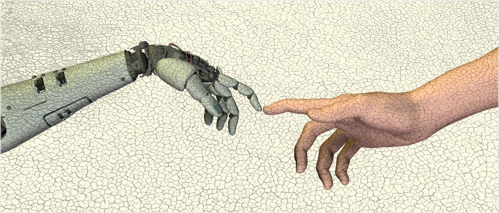

## Welcome to the Computer Ethics Education Center!

The Computer Ethics Education Center, based at the University of California, Berkeley, offers materials and resources to teach computer ethics to undergraduate and graduate students in Computer Science and related disciplines.

The materials on this website have been contributed by instructors and teaching assistants of Berkeley’s CS195 course (Social Implications of Computer Technology). To find out more information about CS195, please visit: [https://www2.eecs.berkeley.edu/Courses/CS195/](https://www2.eecs.berkeley.edu/Courses/CS195/).

## How to navigate this website?

The Syllabus page presents a sample syllabus that you can integrate into the design of your computer ethics class or discussion. You are free to use the same syllabus or modify it better to suit your teaching needs.

## Comments or ideas?

The Modules pages contain materials to teach a specific topic from the syllabus. The materials include reading questions, discussion topics, and assignments.

We are always happy to hear your comments and ideas! Please reach out to us at computer-ethics[at]berkeley.edu.